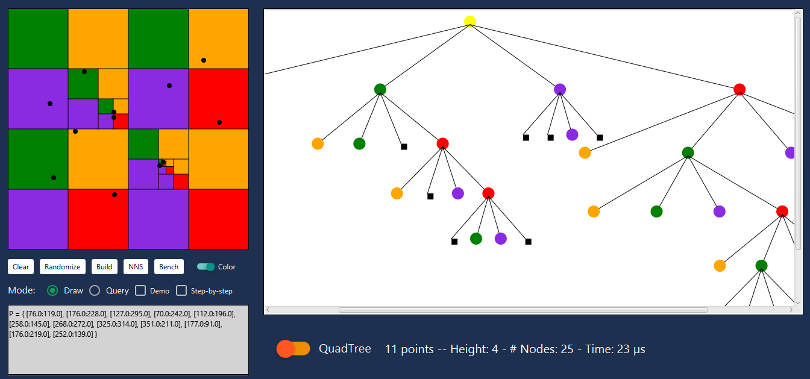
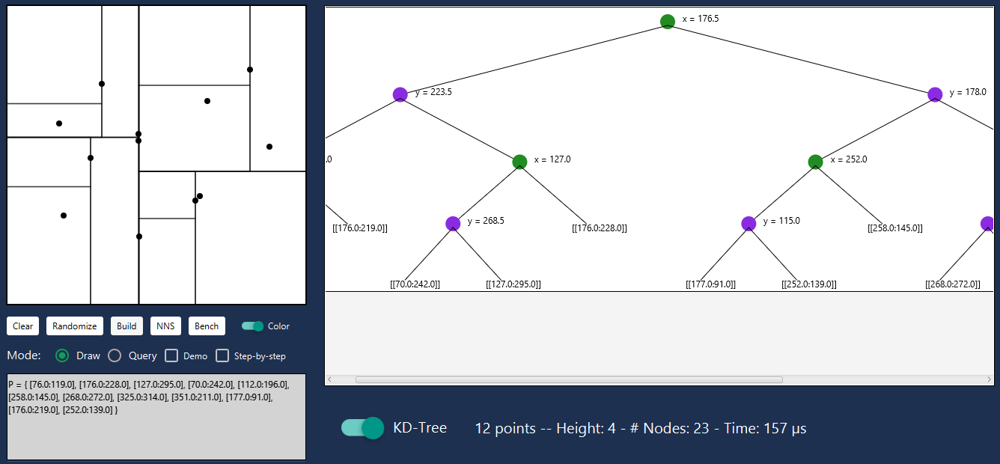
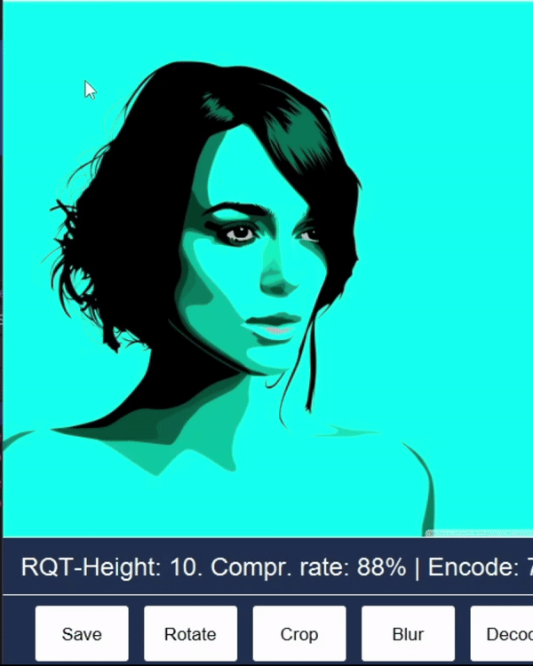

# KD-Trees & Quadtrees

KD-Trees and Quadtrees implementations for two-dimensional point data.

## Overview

This repository contains a Java GUI application for KD trees and quadtrees along with a C++ project for benchmarks.

## Directory Structure

- `Quad-KD-Tree/`: Contains the Java GUI application for KD trees and quadtrees.
- `Quad-KD-Benchmarks/`: Contains the C++ project for benchmarks.

## Getting Started

### Prerequisites

- Java SDK (version 21)
- C++ Compiler (e.g., g++)

### Running the Java Project

1. From root directory run the following command
    ```bash
    mvn clean install
    ```
2. Got to `target/`
3. Run

  ```bash
    java -jar Quad-KD-Trees-1.0-SNAPSHOT-shaded.jar
   ```

### Point-Trees Demo

In main menu, click

1. add some points by clicking on the white pane on the left
2. click Build and toggle the color switch Color
   
3. You can still add points dynamically by clicking on the left pane
4. click NNS button to create a random query Point and approximate NN are highlighted
   
5. Click Query RadioButton to test rectangular-range-query (simply draw a rectangle on the left pane)

Step-by-step mode:

1. Clear the pane
2. add Points
3. click Step-by-step checkbox
4. Build the tree with 'Build' button: Everytime the button is clicked, the next
   level of the tree gets rendered.

For KD-Trees:

1. Toggle the big orange ToggleSwitch
2. do the same as with Quadtrees

### Region Quadtree

#### Encode Image


#### Decode Image


#### Image at different depths of tree


#### Crop function



Currently shown image can be saved via Save button. To stop animation, toggle the switch

## Running the C++ Project

### Navigate to Quad-KD-Benchmarks/

1. Google benchmarks: Navigate to src/build and run

```bash
    cmake ..
    ./benchmark
 ```

2. Space benchmarks: Navigate to src/spacer/build

    ```bash
      cmake ..
    ./benchspace
    ```
3. Run tests with make (Makefile in tests directory)

## License

This project is licensed under the [MIT License](LICENSE).
